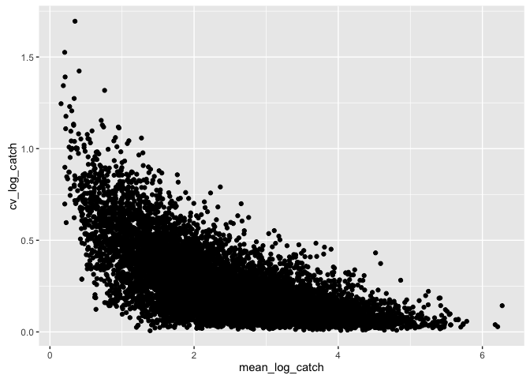
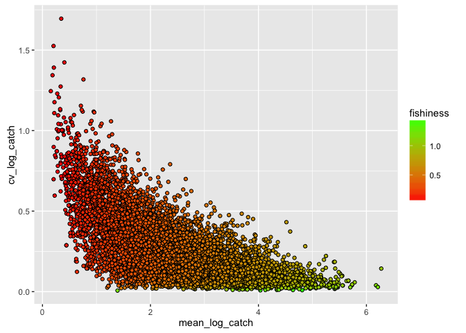
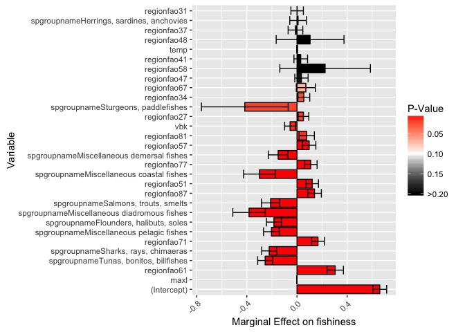
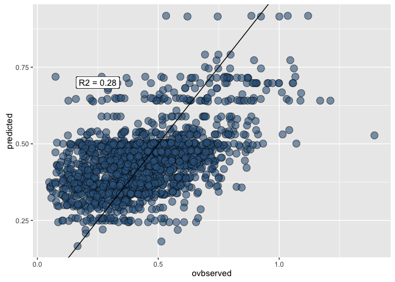
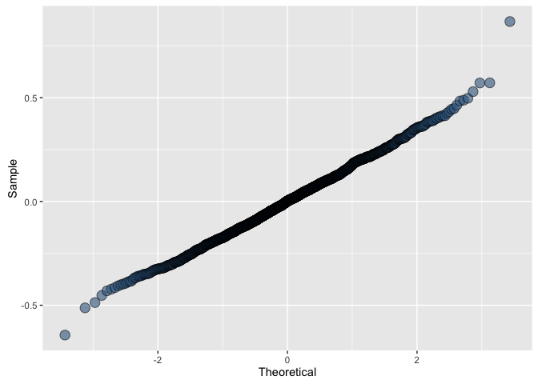
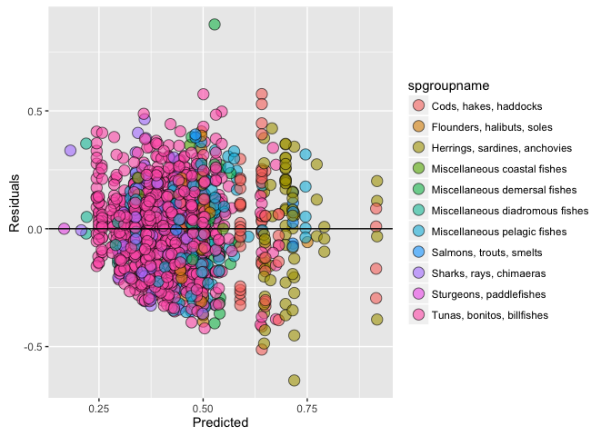
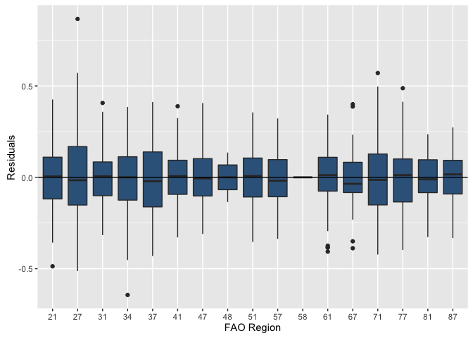
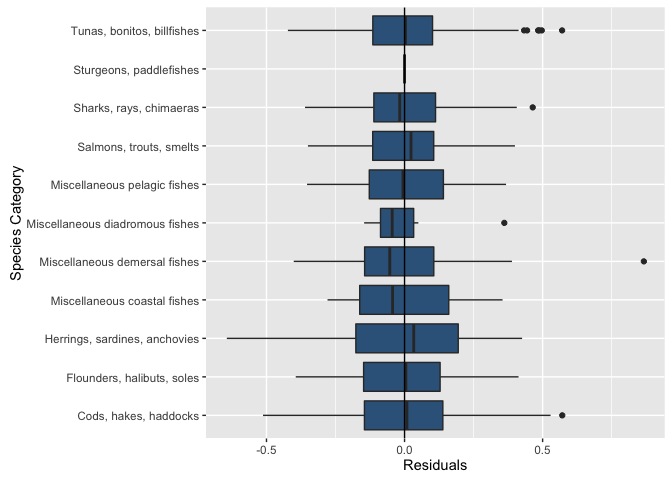

Overview
--------

> Data scientists, according to interviews and expert estimates, spend
> from 50 percent to 80 percent of their time mired in the mundane labor
> of collecting and preparing data, before it can be explored for useful
> information. - [NYTimes
> (2014)](http://www.nytimes.com/2014/08/18/technology/for-big-data-scientists-hurdle-to-insights-is-janitor-work.html)

This tutorial will cover the `tidyr` and `dplyr` packages created by the
mythical code wizard [Hadley Wickham](https://github.com/hadley) of
`ggplot2` fame. The "gg" in `ggplot2` stands for the "grammar of
graphics". Hadley similarly considers the functionality of the two
packages `dplyr` and `tidyr` to provide the "grammar of data
manipulation". The following topics will be covered:

### Resources

-   [Data wrangling cheatsheet
    (`dplyr`,`tidyr`)](http://ucsb-bren.github.io/refs/cheatsheets/data-wrangling-cheatsheet.pdf)
-   [Data wrangling with R and
    RStudio](https://www.rstudio.com/resources/webinars/data-wrangling-with-r-and-rstudio/)
-   [slides](http://ucsb-bren.github.io/env-info/wk03_dplyr/wrangling-webinar.pdf)
-   [dplyr vignette: Introduction to
    dplyr](https://cran.rstudio.com/web/packages/dplyr/vignettes/introduction.html)
-   [Two-table
    verbs](https://cran.rstudio.com/web/packages/dplyr/vignettes/two-table.html)
-   [Window functions and grouped
    mutate/filter](https://cran.rstudio.com/web/packages/dplyr/vignettes/window-functions.html)
-   [Databases](https://cran.rstudio.com/web/packages/dplyr/vignettes/databases.html)
-   [Non-standard
    evaluation](https://cran.rstudio.com/web/packages/dplyr/vignettes/nse.html)
-   [tidyr vignette: Tidy
    data](https://cran.r-project.org/web/packages/tidyr/vignettes/tidy-data.html)
-   [Introduction to dplyr for Faster Data Manipulation in
    R](https://rpubs.com/justmarkham/dplyr-tutorial)
-   [Environmental Informatics |
    ucsb-bren/env-info](http://ucsb-bren.github.io/env-info/)
-   bigrquery tutorials:
-   [A new data processing workflow for R: dplyr, magrittr, tidyr,
    ggplot2 | Technical Tidbits From Spatial Analysis & Data
    Science](http://zevross.com/blog/2015/01/13/a-new-data-processing-workflow-for-r-dplyr-magrittr-tidyr-ggplot2/) (newer)
-   [Fetching BigQuery
    Data](http://dtkaplan.github.io/CVC/Data/Birthdays/Birthdays.html)

### Getting Started

You can [download
RStudio](https://www.rstudio.com/products/rstudio/download/) if you
don't have latest version `0.99.892` (menu RStudio -&gt; About RStudio),
which has many nice additions for running R chunks and providing table
of contents in Rmarkdown documents.

Install and/or load the following packages:

    ## Install packages if needed
    # install.packages('devtools')
    # install.packages('readr')
    # install.packages('dplyr')
    # install.packages('tidyr')
    # install.packages('stringr')
    # install.packages('ggplot2')

    # Load packages
    library(devtools)
    library(readr)
    # library(plyr)
    library(dplyr)
    library(broom)
    library(tidyr)
    library(stringr)
    library(ggplot2)

    # Check package versions after Packages pane -> Update
    devtools::session_info()

### Why use dplyr and tidyr?

1.  **Speed** - dplyr and tidyr are *really* fast  
2.  **Readability** - the code syntax is straightforward and easy to
    read  
3.  **Chaining** - *never break the chain*. More on this later  
4.  **Integrates with ggplot2** - plot your data in the same workflow
    that you manipulate it with
5.  **Can be used to analyze external databases without knowledge of
    additional database query languages**

Basics of dplyr and tidyr
-------------------------

### Data frames and data tables

Although technically two separate packages, **dplyr** and **tidyr** were
designed to work together and can basically be thought of as a single
package. They are designed to work with data frames as is, but it is
generally a good idea to convert your data to table data using the
`read_csv()` or `tbl_df()` functions, particularly when working with
large datasets.

    ## Comparing read.csv with read_csv
    # Read in FAO data
    fao   <- read.csv(file = 'data/FAO_1950to2012_111914.csv', stringsAsFactors = F) 
    summary(fao)
    head(fao)
    # vs using read_csv
    fao   <- read_csv(file = 'data/FAO_1950to2012_111914.csv') 
    fao
    # note: read_csv like read.csv(...)
    #       also keeps original column names and converts to tbl_df()
    names(fao) = make.names(names(fao), unique=T) # since original column names have duplicates

    ## Consider what happens with the following command
    # fao # all entries are printed in your console
    head(fao) # top five entries are printed in your console, columns wrap and can be difficult to follow if working with many variables
    summary(fao)

    ## With dplyr
    fao<-tbl_df(fao) # convert to table data
    fao # now top 10 rows are shown along with data type of each variable. Variables that do not fit in console window are shown below.
    glimpse(fao) # view all columns 
    summary(fao)
    if (interactive()) View(fao) # interactive==T if in Console, not knitting

### Tidy data

In general, it is good practice to have your data organized in a "tidy"
format.

In tidy data:

-   Each variable forms a column  
-   Each observation forms a row  
-   Each type of observational unit forms a table

### Main verbs of dplyr and tidyr

Tidyr and dplyr are designed to help manipulate data sets, allowing you
to convert between *wide* and *long* formats, fill in missing values and
combinations, separate or merge multiple columns, rename and create new
variables, and summarize data according to grouping variables.

Dplyr and tidyr rely on the following main verbs:

-   Tidyr
-   `gather()` and `spread()` convert data between wide and long
    format  
-   `separate()` and `unite()` separate a single column into multiple
    columns and vice versa  
-   `complete()` turns implicit missing values in explicit missing
    values by completing missing data combinations

-   Dplyr
-   `filter()` subset data based on logical criteria  
-   `select()` select certain columns  
-   `arrange()` order rows by value of a column  
-   `rename()` rename columns  
-   `group_by()` group data by common variables for performing
    calculations  
-   `mutate()` create a new variable/column  
-   `summarize()` summarize data into a single row of values

Note that *unquoted* variable names are used by default in tidyr and
dplyr functions.

We'll use these verbs to process the raw FAO landings data into a more
manageable tidy format.

#### Gather and Spread

First let's convert the FAO data from the current wide format to a long
format.

    # Let's convert the fao data from it's current wide format to a long format using gather(). Note the use of helper fnc
    d <- gather(fao, key='Year', value='Catch', num_range('X',1950:2012)) # ?select for num_range()

    # We can convert back to wide format with the spread function by calling the previously created variables
    spread(d,Year, Catch)

    if (interactive()) View(d) # interactive==T if in Console, not knitting
    # to handle: '-','...',' F','X'

#### Rename

Now let's rename the columns to more manageable names (syntax is *new
name* = *old name*)

    # Note the use of backticks around column names with special characters like "("
    d <- dplyr::rename(d,
              country     = Country..Country.,
              commname    = Species..ASFIS.species.,
              sciname     = Species..ASFIS.species..2,
              spcode      = Species..ASFIS.species..1,
              spgroup     = Species..ISSCAAP.group.,
              spgroupname = Species..ISSCAAP.group..1,
              regionfao   = Fishing.area..FAO.major.fishing.area.,
              unit        = Measure..Measure.,
              year        = Year,catch=Catch)

#### Select

Remove unwanted columns and observations.

    # we could chose all the columns to keep
    select(d,country, commname, sciname, spcode, spgroupname, regionfao, year, catch)

    # but it's easier to just specify the columns to get rid of
    d<-select(d,-spgroup,-unit)

There are also a number of **helper functions** that can be used in
conjunction with `select()` to let you select without individually
listing all those you wish to keep or drop. We used a helper function
previously in our `gather()` function and now we'll try a few others.

    # select all coloumns that begin with the letter s
    select(d, starts_with('s'))

    # select columns that match a regular expression
    select(d, matches('*name'))

    # select columns between two columns by referencing their position like normal [,x:y] syntax 
    select(d, country, spcode:year)

    # select every column (though I haven't found a situation where this is useful yet...)
    select(d,everything())

#### Arrange

Arrange entries by country, scientific name, fao region and year. You
can use `desc()` within `arrange()` to control which variables you want
to order in ascending or descending fashion

    # arrange by country, sciname, regionfao, and year
    d<-arrange(d,country,sciname,regionfao,year)

    # if we'd like the years to be descending
    arrange(d, country, desc(sciname), regionfao, desc(year))

    # if we want to first order by species
    arrange(d, sciname, country, regionfao, year)

#### Mutate

Mutate can be used to edit existing variables or create new ones.

    d <- mutate(d,
                year      = as.numeric(str_replace(year, 'X', '')), # strip X off all year values and convert to numeric
                catch     = as.numeric(str_replace(catch, c(' F','...','-'), replacement = '')),
                logcatch  = log10(catch)) # create a  new variable of log catch

#### Filter

Remove unwanted rows/observations.

    # remove the "Totals" values and any years with NA catch values
    d<-filter(d,!(country %in% c('Totals - Quantity (number)','Totals - Quantity (tonnes)')) & !is.na(catch))

    # print data
    d

### Piping and chaining code

While the above workflow is perfectly acceptable, dplyr allows you to
use the *pipe* (`%>%`) operator to *chain* functions together. Chaining
code allows you to streamline your workflow and make it easier to read.

When using the `%>%` operator, first specify the data frame that all
following functions will use. For the rest of the chain the data frame
argument can be omitted from the remaining functions.

Now consider the same process as before only using pipes and a single
dplyr chain:

    d <- fao %>%
      gather(key='Year',value = 'Catch',num_range('X',1950:2012)) %>% # convert to long format
      rename(
        country     = Country..Country., # rename columns
        #country     = `Country (Country)`, # backtick trick!
        commname    = Species..ASFIS.species.,
        spcode      = Species..ASFIS.species..1,
        sciname     = Species..ASFIS.species..2,
        spgroup     = Species..ISSCAAP.group.,
        spgroupname = Species..ISSCAAP.group..1,
        regionfao   = Fishing.area..FAO.major.fishing.area.,
        unit        = Measure..Measure.,
        year        = Year,
        catch       = Catch) %>%
      select(-spgroup,-unit) %>% # drop spgroup, regionfaoname, and unit variables
      arrange(country,sciname,regionfao,year) %>% # order by country, sciname, regionfao, and year
      mutate(
        year        = as.numeric(str_replace(year, 'X', '')), # strip X off all year values and convert to numeric
        catch       = as.numeric(gsub(catch, pattern=c(' F'), replacement = '', fixed = T)),
        logcatch    = log10(catch)) %>% # create a  new variable of log catch 
      filter(!country %in% c('Totals - Quantity (number)','Totals - Quantity (tonnes)') & !is.na(catch)) # remove 'Totals' rows - rows: 1,114,596 -> 310,619

    ## Warning in eval(substitute(expr), envir, enclos): NAs introduced by
    ## coercion

    # print data frame
    d

By chaining our code we were able to reproduce the same data frame
without the need to continually overwrite it, and we can easily read
each step in the process by observing the different verbs. We also only
needed to reference the original data frame (fao) at the beginning of
the chain rather than in each function call.

#### Complete

Now our data is nice and tidy, but we realize that we actually want to
retain NA values for years with missing catch data. We could just go
back and remove the second argument from our `filter()` function. Or we
could use the nifty `complete()` function to add in the missing
combinations.

    d %>%
      complete(year = 1950:2012)

    d %>%
      group_by(country,sciname,commname,regionfao,spgroupname,spcode) %>%
      complete(year = 1950:2012) %>%
      ungroup()

#### Separate and Unite

The `df$spcode` variable actually consists of 5 individual parts.

We decide we want to create a new column for each taxonomic division of
the spcode. We can accomplish this with `separate()` and undue it with
`unite()`

    # create new variables for each taxonomic component 
    d<-separate(d,spcode, into = c('maintaxa','order','family','genus','species'), sep = c(2,4,6,9))

    # recombine the columns with unite 
    d<-unite(d, col = spcode, maintaxa:species, sep = '') # Note - we can use helper functions here if needed

### Joins

So far we've been working with a single data frame, but dplyr provides a
handful of really useful **join** functions that allow you to combine
datasets in a variety of ways. To demonstrate the different methods of
joining, we will combine our FAO dataset with a dataset of life history
information from FishBase.

Dplyr allows for *mutating* joins and *filtering* joins. Mutating joins
will combine information from both data frames in different ways, while
filtering joins will filter a single dataset based on matches in another
data set.

For joins to work, variable names must be the same in both datasets.
This often requires using `rename()` prior to your join functions if you
do not want to permanently alter the variable names in each dataset.

-   Mutating joins
-   `left_join(a, b, by = c('...'))` join matching rows from b to a by
    matching variables in vector  
-   `right_join(a, b, by = c('...'))` join matching rows from a to b by
    matching variables in vector  
-   `inner_join(a, b, by = c('...'))` join data, retaining only rows in
    both a and b  
-   `full_join(a, b, by = c('...'))` join data, retaining all values,
    all rows

Lets use join functions to explore adding life history parameters to our
FAO data

    # read in life history data
    load(file = 'data/mpack.Rdata')
    lh<-mpack$lh
    rm(mpack)

    lh<-lh %>%
      tbl_df() %>%
      dplyr::rename(sciname=sname) %>% # rename to sciname for joining
      select(sciname,vbk,temp,maxl,agem) %>% # select variables we wish to add
      slice(match(unique(lh$sname),lh$sname))

    # first let's pull out all species US fisheries
    us<- d %>%
      ungroup() %>%
      filter(country=='United States of America' & year==2012) %>%
      select(country, sciname, commname, spgroupname) %>%
      distinct()
      
    # left join to retain all data in our d data frame. 
    us %>% 
      left_join(lh, by = 'sciname') # we only need to specify the right hand data set to join lh with since we've piped

    # right join to keep all lh data.  
    us %>%
      right_join(lh, by = 'sciname')

    # inner join to only keep data for which we have matches in both data sets
    us %>%
      inner_join(lh, by = 'sciname')

    # full join to keep all data for both data sets
    us %>%
      full_join(lh, by = 'sciname')

Analyzing and Manipulating Data
-------------------------------

Now that we have our cleaned data in a tidy format let's do some
analyses. First, here are a few more simple examples of chaining code to
select, filter, and arrange our data to obtain different subsets.

    # Canada's fisheries from largest to smallest in 2012
    d %>%
      filter(country=='Canada' & year==2012) %>%
      select(year,country,commname,catch) %>%
      arrange(desc(catch))

    # All fisheries in the Northwest Atlantic with a catch over 1000 MT
    d %>%
      filter(regionfao==21 & year==2012 & catch>=1000) %>%
      select(country,commname,regionfao,catch) %>%
      arrange(desc(catch))

    # Which countries have the 10 largest shark fisheries?
    d %>%
      filter(spgroupname=='Sharks, rays, chimaeras' & year==2012) %>%
      select(country,commname,catch) %>%
      arrange(desc(catch)) %>%
      slice(1:10)

### Grouping, Summarizing, and Mutating Data

Dplyr uses two main verbs to analyze data, `summarize()` and `mutate()`.
Summary functions will summarize data two produce a single row of output
while mutate functions create a new variable the same length as the
input data. For both functions, you first indicate the name of the
variable that will be created and then specify the calculation to be
performed.

-   Example: `totalcatch=sum(catch,na.rm=T)`

The `group_by()` function lets you specify the level across which to
apply your calculations.

-   A key thing to remember is to always `ungroup()` your data if you
    intend to perform additional calculations, as grouped data frames
    can result in incorrect results downstream if performed at
    different levels.

Using `group_by()` and `summarize()` let's calculate total global
harvest from 1950 to 2012 for several groups of data

    # Total global harvest
    global <- d %>%
      ungroup() %>%
      group_by(year) %>%
      dplyr::summarize(totalcatch=sum(catch,na.rm=T)) %>%
      ggplot(aes(x=year,y=totalcatch)) +
      geom_line()

    # Global harvest by country
    cntry<-d %>%
      group_by(year,country) %>%
      dplyr::summarize(totalcatch=sum(catch, na.rm=T)) %>%
      ungroup() %>% # -- Here's an example of why you need to ungroup! --
      dplyr::arrange(country)

    # Global harvest by species category
    spcatch <- d %>%
      group_by(year,spgroupname) %>%
      dplyr::summarize(totalcatch=sum(catch, na.rm=T)) %>%
      ungroup() %>% 
      arrange(spgroupname)

    # USA harvest by species category over time
    usa<- d %>%
      filter(country=='United States of America') %>%
      group_by(year,country,spgroupname) %>%
      dplyr::summarize(totalcatch=sum(catch,na.rm=T)) %>%
      ungroup() %>%
      arrange(spgroupname)

Now let's use mutate to calculate some additional information for our
datasets

    # Calculate what % of global catch each country contributes in each year and for rank each year by that %
    cntry %>%
      group_by(year) %>%
      mutate(
        globalcatch = sum(totalcatch,na.rm=T),
        globalrank  = dense_rank(totalcatch)) %>% # global catch and cntry rank
      group_by(year,country) %>% # now we group by a different level before our next calculation
      mutate(
        percglobal = 100*(totalcatch/globalcatch)) %>%
      group_by(country) %>%
      mutate(
        ingrouprank = dense_rank(totalcatch))

### Using Dplyr with `broom` and `ggplot2`

One of the best aspects of working with tidy data and `dplyr` is how
easy it makes it to quickly manipulate and plot your data. Property
organized, it's a piece of cake to quickly make summaries and plots of
your data without making all kinds of "temporary" files or lines of
spaghetti code for plotting. You can also basically eliminate loops from
your coding for all situations except that those that require dynamic
updating (e.g. population models).

For this next exercise, we're going to use `tidyr`, `dplyr`, `broom`,
and `ggplot2` to fit a model, run diagnostics, and plot results.

It's 3am. You've been chasing the same cryptic error message for two
days (
`Error: towel not found, don't panic!`). You decide enough is
enough: you're going to pack it in, buy a boat and become a fisherman.
The only problem is, years of coding have left you with no knowledge of
the outside world besides what R and data can tell you. How are you
supposed to know what to fish for, or where to fish? Luckily, you have
some data, so you turn to your laptop one last time before hurling it
off of a cliff in a ritualistic sacrifice to the sea gods.

You want to find a fishery to join based on two criteria: high average
catch, and low average variability. You might now know these data
though, so you want to be able to predict what fishery to join based on
geographic and life history traits.

Our first goals:

1.  Generate a unique ID for each fishery

2.  Calculate the mean log lifetime catch of each fishery

3.  Calculate the coefficient of variation of each fishery

4.  Filter out fisheries with short time series

<!-- -->

    # Prep our data
    dat <- d %>%
      ungroup() %>% #Often a good idea to ungroup before starting something new
      mutate(id = paste(country,spcode,regionfao, sep = '_')) %>% #Generate a unique ID for each fishery
      group_by(id) %>%
      mutate(mean_log_catch = mean(logcatch, na.rm = T), cv_log_catch = sd(logcatch, na.rm = T)/mean(logcatch, na.rm = T), length_catch = sum(is.na(logcatch) == F & logcatch >0)) %>% # we want to keep some of the other data as well
      filter(year == max(year) & length_catch > 10 & is.finite(mean_log_catch) == T & cv_log_catch >0) %>% # We don't want repeated entries, so let's just grab one random year
      dplyr::select(-year, -catch, -logcatch)

    # Always plot!
    ggplot(dat, aes(mean_log_catch,cv_log_catch)) + 
      geom_point()

<!-- -->

OK, we see we're onto something here: there's clearly a relationship
between average catch and the CV of the catch. We want to build a model
that predicts that. Let's create a composite score of the mean log catch
and the inverse of the CV. We're going to scale the log catches by the
maximum log catch, and the CV by the the maximum of 1/CV. We also want
to add in our nice life history data

    regdat <-  dat %>%
      ungroup() %>% #we want global statistics now
      mutate(scaled_ml_catch = mean_log_catch/max(mean_log_catch), scaled_cv_catch =  (cv_log_catch/min(cv_log_catch))^-1, fishiness = scaled_ml_catch + scaled_cv_catch) %>%
      left_join(lh, by = 'sciname')

    regplot <- regdat %>% #great thing about ggplot is the ability to save as an object and use and modify later
      ggplot(aes(mean_log_catch,cv_log_catch, fill = fishiness)) + 
      geom_point(shape = 21) + 
      scale_fill_gradient(low = 'red',high = 'green')

    regplot # grea

<!-- -->

Now we're getting somewhere! Now, lets run a regression using life
history and geographic variables to try and predict the quality of
fishing.

    reg_vars <- c('regionfao', 'spgroupname', 'vbk','maxl','temp') #specify variables you want

    class(regdat$regionfao) #whoops, it things FAO region is an integer, we want a factor

    filtered_dat <- regdat %>%
      ungroup() %>%
      mutate(has_all = apply(is.na(regdat[,reg_vars]) == F, 1,all)) %>%
      filter(has_all == T) %>%
      mutate(regionfao = as.factor(regionfao),spgroupname = as.factor(spgroupname))

    reg_fmla <- as.formula(paste('fishiness ~',paste(reg_vars, collapse = '+'), sep = '')) #create regression formula

    fish_model <- lm(reg_fmla, data = filtered_dat) #run a linear regression
    summary(fish_model)

Now we've got a model! we're close to being able to use data to predict
where we'll start our fishing operation. But, while we know nothing
about fishing, we are good statisticians, and we know we should look at
our regression before using it to make a big life decision. This is
where `broom` comes in. R has all kinds of great functions, like
`summary()` to look at regressions. But, they can be a little ad hoc,
and difficult to manipulate. `broom` helps us tidy up our regression
data. First, suppose that we want a better way to look at summary
statistics from the regression. The `glance()` function from the `broom`
package extracts important summary statistics from the model, like the
*R2*, the AIC, and the BIC.

    library(broom)
    reg_summary <- glance(fish_model)

    reg_summary

Unfortunately, our model is pretty poor; it only explains ~20% of the
variation in the `fishiness` variable, but hopefully it's better than
guessing. Let's dig into this model a bit more. We're going to use the
`tidy()` function from the `broom` package to provide neat summaries of
the model coefficients.

    tidy_model <- tidy(fish_model)

    tidy_model$variable<- as.factor(tidy_model$term) #convert terms to factors

    tidy_model$variable <- reorder(tidy_model$variable, tidy_model$p.value) #sort variables by pvalue

    tidy_model$short_pval<- pmin(tidy_model$p.value,0.2) #create abbreviated version

    regression_plot <- (ggplot(data=tidy_model,aes(x=variable,y=estimate,fill=short_pval))+
                          geom_bar(position='dodge',stat='identity',color='black')+
                          scale_fill_gradient2(high='black',mid='gray99',low='red',midpoint=0.1,
                                               breaks=c(0.05,0.1,0.15,0.2),labels=c('0.05','0.10','0.15','>0.20')
                                               ,name='P-Value',guide=guide_colorbar(reverse=T))
                        +theme(axis.text.x=element_text(angle=45,hjust=0.9,vjust=0.9))+
                          geom_errorbar(mapping=aes(ymin=estimate-1.96*std.error,ymax=estimate+1.96*std.error))+
                          xlab('Variable')+
                          ylab(paste('Marginal Effect on ',names(fish_model$model)[1],sep='')) + 
                          coord_flip())

    regression_plot

<!-- -->

So, we can now see that most of the significant terms are region
specific, and the life history data doesn't give us a whole lot of
information on where we should start fishing. So far, the model is
saying go fish in China, and maybe avoid salmons, halibuts, and tunas.

Before we charge off and use these results though to decide where we're
starting our new life, we're now going to use the `augment()` function
in the `broom` package to help us run some diagnostics on the
regression. The `augment` function takes our original data passed to the
regression, and adds all kinds of things, like the values predicted by
the model and the residuals. This makes it very useful for regression
diagnostics. First off, we might want to check whether our errors are
actually normally distributed

    auged_reg <- augment(fish_model)

    obs_v_pred <- auged_reg %>%
      ggplot(aes(fishiness, .fitted)) + 
      geom_point(shape = 21, size = 4, alpha = 0.6, fill = 'steelblue4') + 
      geom_abline(aes(slope=1, intercept = 0)) + 
      xlab('ovbserved') + 
      ylab('predicted') + 
      geom_label(aes(0.25,0.7), label = paste('R2 = ', round(reg_summary$r.squared,2), sep = ''))

    obs_v_pred

<!-- -->

      qq_plot <- auged_reg %>% #create quantile-quantile plot
        ggplot(aes(sample = .resid)) +
        stat_qq(shape = 21, size = 4, alpha = 0.6, fill = 'steelblue4') +
        xlab('Theoretical') +
        ylab('Sample')

      qq_plot

<!-- -->

We see that our data are in fact normally distributed, that's good!
Let's check for heteroskedasticity and model misspecification.

      hetsk_plot <- auged_reg %>% #plot fitted vs residuals
        ggplot(aes(.fitted, .resid)) +
        geom_point(shape = 21, size = 4, alpha = 0.6, fill = 'steelblue4') +
      geom_hline(aes(yintercept = 0)) + 
        xlab('Predicted') +
        ylab('Residuals')

    hetsk_plot

Looks a little iffy, we've got some heteroskedasticity going on. Let's
try and see where it is. The great thing about `broom` is that it makes
it really easy to manipulate data and plot diagnostics based on the
original data.

      hetsk_plot2 <- auged_reg %>% 
        ggplot(aes(.fitted, .resid, fill = spgroupname)) +
        geom_point(shape = 21, size = 4, alpha = 0.6) +
      geom_hline(aes(yintercept = 0)) + 
        xlab('Predicted') +
        ylab('Residuals')

    hetsk_plot2

<!-- -->

So, we see here that the culprit are the herrings and salmons. That
tells us to be a little cautious in our predictive ability and estimated
errors based on this model, and maybe we need to do a better job of
clustering our errors. Let's look at things another way. We saw from the
coefficient plot that the region effects are the most significant in the
model. How confident are we in those?

      regional_bias <- auged_reg %>% #Check residuals by group
      ggplot(aes(regionfao,.resid)) + 
      geom_boxplot(fill = 'steelblue4') + 
      geom_hline(aes(yintercept = 0)) + 
      xlab('FAO Region') + 
      ylab('Residuals')

    regional_bias

<!-- -->

      species_bias <- auged_reg %>%
      ggplot(aes(spgroupname,.resid)) + 
      geom_boxplot(fill = 'steelblue4') + 
      geom_hline(aes(yintercept = 0)) + 
      xlab('Species Category') + 
      ylab('Residuals') + 
        coord_flip()
      
      species_bias

<!-- -->

All in all then, we've got some heteroskedasticity that makes us a
little suspicious of our standard errors, but no major biases in our
estimation. Our life choice model works! Let's move to China and fish
whatever, the model says it doesn't matter.

### In defense of `plyr`

One quick note. `dplyr` has taken over for a lot of the things we used
to use `plyr` for. But, `plyr` is still useful for manipulating other
types of objects instead of data frames. Specifically, I use `plyr` to
convert lists and arrays to data frames.

Sometimes its useful to use lists. Suppose that I have a function that I
want to evaluate a bunch of times. Loops can be cumbersome for a variety
of reasons. Let's write a function and apply it over a vector instead.

    foo <- function(x){ #random function
      
      y <- x^2
      
      return(y)
    }

    food <- lapply(1:100,foo) #this can be more efficient and simpler than loops

Now, we've applied our function over 100 values. But, they're stuck in
list form. `plyr` to the rescue! So long as each element in every list
has the same dimensions, `ldply` will "smash" the list into a data frame

    foody <- plyr::ldply(food)

The syntax is simple. `ldply` converts lists to data frames. `adply`
converts arrays to data frames. You get the idea. Huge warning here.
**Make sure** you load the `plyr` library **before** `dplyr`. Otherwise,
bad bad things can happen. R will even throw a warning if you do it the
other way around. Or, more simply, instead of loading the library, just
use `plyr::ldply`. This loads that function for that instance, without
actually loading into the environment and masking other things.

### A quick warning on speed

So far, we've been preaching the `dplyr` gospel pretty hard. All in all,
it makes code faster, more efficient, and much easier to read. But,
there are times when its best to keep it simple, especially where speed
is critical. This is less `dplyr`'s fault, than some issues with data
frames themselves.

We are going to compare two functions that do the same thing, one using
dplyr and data frames and one that uses more basic R functions. The goal
is a function that calculates the mean length of catch history in an fao
region

    dplyr_fun <- function(region,dat)
    {
      out <- dat %>%
        filter(regionfao == region) %>%
        summarise(mean_length = mean(length_catch))
      
      return(out)
    }

    basic_fun <- function(region,dat)
    {
      out <- mean(as.numeric(dat[dat[,'regionfao'] == region,'length_catch']))
      return(out)
    }

    regions <- rep(unique(as.character(regdat$regionfao)), 100) #thing to test

    startime <-  proc.time() #time the dplyr version
    a <- lapply(regions, dplyr_fun, dat = regdat)
    t1 <- proc.time() - startime

    startime <-  proc.time() #time the basic version
    b <- lapply(regions, basic_fun, dat = as.matrix(regdat))
    t2 <- proc.time() - startime

    t1[1]/t2[1]

    ## user.self 
    ##  6.785075

    all(plyr::ldply(a)$V1 == plyr::ldply(b)$V1) #check and make sure they do the same thing

    ## [1] TRUE

The `dplyr` version of the function takes nearly 7 times as long as the
same function in basic notation! The difference between .45 and 3.1
seconds doesn't matter much in most cases, but if you're doing huge
numbers of simulations, say in an MCMC, this starts to add up. This can
be the difference between a model running a day and a few hours.

This time sink doesn't always hold true, `dplyr` will often be faster
than bunches of nested loops, but when speed is a priority, it's worth
checking to see using matrices instead of data frames and `dplyr` will
save you some serious time.

Advanced Dplyr Applications
---------------------------

### Underscore Functions

Often, when writing functions with dplyr we may want to be able to
specify different grouping variables. But wait, dplyr arguments use
unquoted variable names! Have no fear, underscore is here!

Check out the following two functions:

    # function using standard dplyr functions
    fun1<-function(x,gpvar1,gpvar2,gpvar3){
      y<-x %>%
        group_by(gpvar1) %>%
        mutate(globalcatch=sum(totalcatch,na.rm=T),globalrank=dense_rank(totalcatch)) %>% # global catch and cntry rank
        group_by(gpvar2) %>% # now we group by a different level before our next calculation
        mutate(percglobal=100*(totalcatch/globalcatch)) %>%
        group_by(gpvar3) %>%
        mutate(ingrouprank=dense_rank(totalcatch))
      return(y)
    }

    fun1(spcatch, gpvar1 = year, gpvar2 = c(year,country), gpvar3 = country) # !!!!! THIS WILL NOT WORK !!!!!

    # function using underscores
    fun1<-function(x,gpvar1,gpvar2,gpvar3){
      y<-x %>%
        group_by_(gpvar1) %>%
        mutate(globalcatch=sum(totalcatch,na.rm=T),globalrank=dense_rank(totalcatch)) %>% 
        group_by_(gpvar2) %>% 
        mutate(percglobal=100*(totalcatch/globalcatch)) %>%
        group_by_(gpvar3) %>%
        mutate(ingrouprank=dense_rank(desc(totalcatch)))
      return(y)
    }  

    # apply function to species category and country datasets
    spcatch<-fun1(spcatch,gpvar1 = c('year'), gpvar2 = c('year','spgroupname'), gpvar3 = c('spgroupname')) 
    cntry<-fun1(cntry,gpvar1 = c('year'), gpvar2 = c('year','country'), gpvar3 = c('country'))   

### Using Dplyr to Query External Databases

Need to setup Google account first, per [A new data processing workflow
for R: dplyr, magrittr, tidyr, ggplot2 | Technical Tidbits From Spatial
Analysis & Data
Science](http://zevross.com/blog/2015/01/13/a-new-data-processing-workflow-for-r-dplyr-magrittr-tidyr-ggplot2/).

    # library(dplyr)
    library(bigrquery) # install.packages('bigrquery')
    sql<-"select * from [publicdata:samples.shakespeare]"
    shakespeare <-query_exec(sql, project ="test-bigquery-1243",max_pages=Inf)

#### Example Analyses

-   [NOAA Storm Data - a Brief Analysis of Impact on Health and
    Economy](http://rstudio-pubs-static.s3.amazonaws.com/25871_1ffdd88781bd4e6194d93fd327a25659.html)
-   [dplyr example with fish data](http://rpubs.com/dogle/31773) (more
    on [Introductory Fisheries Analysis with R |
    fishR](https://fishr.wordpress.com/ifar/))
-   [rnoaa - Access to NOAA National Climatic Data Center
    data](https://ropensci.org/blog/2014/03/13/rnoaa/)
